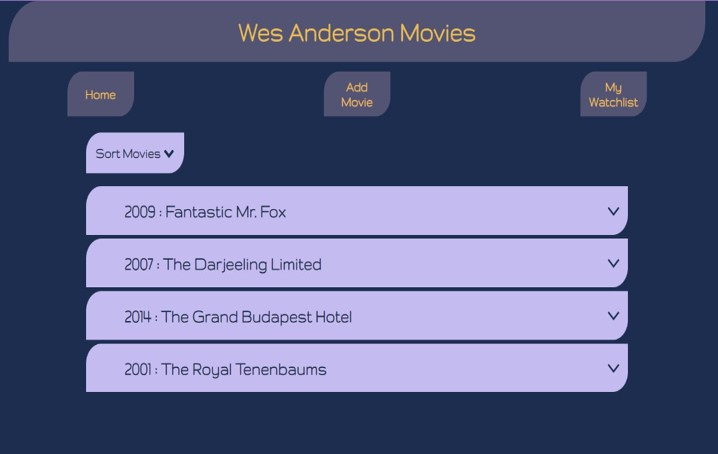

# Movie Data

## Description

Movie data is a user interface built using data from a JavaScript object of Wes Anderson movies. The interface has 3 sections : Home, Add Movie and Watchlist. This project was a lot of fun to build and was a wonderful learning experience.

## Features

\* Home Page: On the home page the movie data is displayed in an accordian. The accordian button has the movie title and year of release. The other movie details are displayed in a panel which opens and shuts on clicking the accordian button. A drop-down menu can be used to sort the movies based on their year of release.

\* Add movie section has a form to add all movie details which would then update the accordian

\* Watchlist section displays posters of all the movies selected by the user to add to the watchlist from description panel of the movies

## Learning and Building

\* This project was a fantastic learning experience as this is the first time I learnt to dynamically create HTML elements. I used mobile first responsive design and an accordian display format for the data.

\* I used Object.entries to return an array of the movie data. I mapped the array to create and display data in a `showAccordian` function. This function included the eventlistener function on the `Add to watchlist` button.

\* I then added eventlisteners on my 3 section buttons to navigate to them. I realised my functions were not working as I overlooked the scope of the variables I had created. I hence created an `init` initialisation function which I then used in all my functions.

\* I then learned how to make constructors to create the movie object for my Add movie form. I also learnt to create a submit button function.

\* Lastly I added the sort function in a drop-down menu for displaying the movies by their release date. they were initially sorted alphabetically. I added a toggle class to show and hide the menu and also a function to close the menu when clicked outside of it. To make the actual sort function work I had to refactor my `showAccordian` function to accept a parameter of a sorted array.
